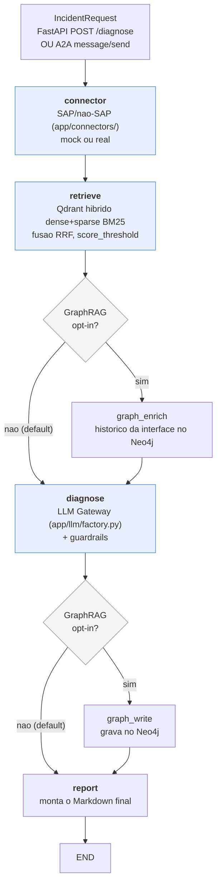

# Arquitetura Detalhada

Visao tecnica do que existe hoje no codigo - nao um plano aspiracional.
Para o "porque" de cada decisao (problemas reais encontrados e como
foram resolvidos), ver a secao "Decisoes de Arquitetura" no
[README](../README.md); este documento e o "o que" e "onde".

## Fluxo

Os nodes `graph_enrich`/`graph_write` (GraphRAG) so entram no grafo
quando `GRAPH_RAG_ENABLED=true` - com a flag desligada (default), o
grafo compilado e identico ao anterior a esta fase, byte a byte na
mesma sequencia de nodes. Ver secao GraphRAG abaixo.

Cada etapa e um node do grafo (`app/agent/graph.py`), instrumentado com
`@observe` (Langfuse). O estado (`CopilotState`) flui entre nodes; o
grafo e compilado uma vez (`get_graph()`, singleton em processo).

Dois "consumidores" chamam a mesma orquestracao (`run_diagnosis`), sem
nenhuma logica duplicada entre eles: o endpoint REST `/diagnose`
(`app/main.py`) e a camada A2A (`app/a2a/`, ver secao propria abaixo).

## Camadas

| Camada | Onde | Responsabilidade |
|---|---|---|
| API | `app/main.py` | FastAPI, `/health`, `/diagnose`, Agent Card A2A; sem logica de negocio |
| A2A | `app/a2a/` | Camada de interoperabilidade externa (Agent Card, task manager, JSON-RPC), chama a mesma orquestracao do `/diagnose` |
| Orquestracao | `app/agent/graph.py` | Grafo LangGraph, prompt, guardrails |
| LLM Gateway | `app/llm/factory.py` | Escolhe o `BaseChatModel` (Ollama/OpenAI/Azure OpenAI) a partir de `Settings` |
| RAG | `app/rag/` | Ingestao (`ingest.py`), busca vetorial (`retriever.py`) via Qdrant, e GraphRAG opt-in (`graph_store.py`) via Neo4j |
| Conectores | `app/connectors/` | Um por sistema externo (OData, RFC, ServiceNow, Salesforce, Workday, SAP Ariba, SAP CAP, SAP API Management); interface comum em `base.py` |
| Config | `app/config.py` | Unica fonte de verdade (`.env` + defaults), nunca hardcoded espalhado |
| Modelos | `app/models.py` | Contratos Pydantic da API (`IncidentRequest`/`DiagnosisResponse`) |

Esta nao e uma Clean Architecture "de livro" com pastas
`domain/application/infrastructure` separadas - e uma separacao
pragmatica por responsabilidade, que ja evita a mistura de
preocupacoes que aquele padrao existe para prevenir (a logica de
prompt/guardrail, por exemplo, sao funcoes puras em `graph.py`,
testaveis sem subir API nem grafo).

**Nota honesta sobre `app/services/`:** a pasta existe (criada cedo,
"para quando precisar") mas continua vazia - propositalmente. Hoje
`run_diagnosis()` (em `graph.py`) ja cumpre o papel de "camada de
servico": e a unica funcao que os dois consumidores existentes
(`/diagnose` e `app/a2a/task_manager.py`) chamam, sem duplicar logica
entre eles. Criar uma classe/modulo `IncidentDiagnosisService` que so
delegasse para essa mesma funcao seria indirecao sem beneficio real -
exatamente o tipo de "camada vazia por vaidade arquitetural" que este
documento critica no `genai-engineering-template` (`src/application/`
la tambem vazio, mas la sem nada que cumprisse o papel por baixo). Se
um dia houver mais de uma logica de orquestracao real para coordenar
(nao so repassar uma chamada), a pasta ganha conteudo entao - nao antes.

## LLM Gateway - por que e como

Ver `app/llm/factory.py` e a Decisao de Arquitetura #10 no README. Em
uma frase: `Settings.llm_provider` decide entre Ollama (default,
local-first, sem custo de API), OpenAI ou Azure OpenAI, sem o resto do
codigo (`graph.py`, prompt, guardrails) precisar saber qual foi
escolhido - todos implementam a mesma interface `BaseChatModel` do
LangChain.

## Conectores - mock vs. real, hoje

Todo conector agora segue o MESMO criterio: configuracao ausente = modo
demo/mock; configuracao presente = chamada real. Nenhum exige mudar
codigo Python para ativar - so preencher variaveis no `.env`.

| Conector | Estado hoje | Falta so |
|---|---|---|
| `ODataConnector` | **Real** (OAuth2 client_credentials + OData v2) quando `ODATA_SERVICE_URL` configurado | Um tenant CPI/Integration Suite real para validar contra producao |
| `RFCConnector` | `use_real=True` chama `BAPI_IDOC_STATUS` de verdade via `pyrfc` | `pyrfc` + SAP NetWeaver RFC SDK (binario da SAP, fora do PyPI) + um sistema SAP acessivel |
| `ServiceNowConnector` | **Real, validado contra ServiceNow PDI real** (Table API via HTTP, Basic Auth) | Nada - segundo conector com validacao ponta-a-ponta contra sistema real |
| `SalesforceConnector` | **Real, validado contra Salesforce Developer Edition real** (OAuth2 Client Credentials + SOQL) | Nada - primeiro conector com validacao ponta-a-ponta contra sistema real, nao so mock |
| `WorkdayConnector` | **Real** (OAuth2 + REST) quando `WORKDAY_TENANT` configurado | Um tenant Workday real |
| `AribaConnector` | **Real** (OAuth2 + REST) quando `ARIBA_BASE_URL` configurado | Acesso a Ariba Network/API Business Hub |
| `CAPConnector` | **Real, validado contra SAP CAP real** (OData v4 + XSUAA client_credentials, BTP Trial) | Nada - terceiro conector com validacao ponta-a-ponta contra sistema real |
| `APIManagementConnector` | ⚠️ **Implementado com schema ESPECULATIVO** (OAuth2 Client Credentials + endpoint assumido por analogia a produtos similares - NAO confirmado contra documentacao real do SAP API Management) | Validar contrato real da Analytics API contra um tenant de verdade; corrigir endpoint/schema conforme necessario |

**Nota sobre a assimetria SuccessFactors↔Workday:** o cenario de
referencia "SuccessFactors↔Workday" e representado hoje SO pelo lado
Workday - "SuccessFactors" aparece apenas como contexto narrativo no
payload mock do `WorkdayConnector` (`grep -rn "SuccessFactors" app/`
confirma isso: zero classe/modulo, so docstring/comentario). Nao ha
`SuccessFactorsConnector` implementado. Isso e uma decisao implicita,
nao documentada ate agora - registrada aqui para nao parecer descuido.

Por que ainda nao foi fechado: SuccessFactors expoe OData v2 (SFAPI)
com autenticacao via SAML bearer assertion, mais complexa que o
padrao OAuth2 client_credentials ja usado nos demais conectores -
exigiria um mecanismo de auth novo, nao reuso do que ja existe.
Registrado como proximo item de backlog de conectores, nao
implementado nesta fase (mesma disciplina de "um conector por vez,
validado, antes do proximo" aplicada aos demais).

"Real" aqui quer dizer: o codigo de producao (fetch de token OAuth2,
montagem do header, parsing da resposta) e exercitado de verdade nos
testes via `httpx.MockTransport` simulando a API documentada de cada
fornecedor - nao existe, para nenhum destes tres ultimos (Salesforce/
Workday/Ariba) nem para o RFC, uma conta/tenant real disponivel para
validar contra producao. Essa e a mesma ressalva ja feita sobre
`RFCConnector._fetch_real` desde a Fase 8, agora estendida a todos os
conectores no mesmo padrao - nao e uma limitacao nova, e a mesma
limitacao aplicada com consistencia.

Por que RFC (nao so OData) importa para o posicionamento do produto:
clientes ainda em ECC on-premise, sem BTP/Integration Suite, tipicamente
so tem RFC/BAPI como via de automacao - e essa e a base de clientes que
nao consegue adotar SAP AI Core (que exige HANA Cloud). Ver
[TCO_SAP_AI_CORE_VS_SELF_HOSTED.md](TCO_SAP_AI_CORE_VS_SELF_HOSTED.md).

## RAG

Duas collections Qdrant independentes (`app/rag/ingest.py`):
`sap_incident_docs` (usada pelo fluxo de diagnostico) e
`sap_reference_library` (livros/estudo pessoal, nao entra no
diagnostico). Ingestao e idempotente (reprocessar um arquivo substitui
os pontos antigos, nao duplica) e resumivel (estado salvo em disco).

## GraphRAG (Neo4j) - opt-in, nao no caminho default

`app/rag/graph_store.py` implementa o que antes era so "reservado para
uso futuro": grava cada diagnostico concluido no Neo4j como um grafo
(`Incident -AFFECTS-> Interface -RUNS_ON-> System`, `Incident
-HAS_ROOT_CAUSE_IN-> Document`) e consulta esse grafo por incidentes
anteriores na MESMA interface antes de gerar um novo diagnostico -
contexto de recorrencia ("essa RFC destination ja teve 3 incidentes
antes, sempre pela mesma causa") que a busca vetorial no Qdrant nao da,
porque Qdrant acha o documento de CONHECIMENTO mais parecido, nao o
HISTORICO relacional de uma interface especifica.

Continua **desligado por default** (`GRAPH_RAG_ENABLED=false`) - a
decisao de manter assim nao mudou (ver Decisao de Arquitetura #9): o
Qdrant ja resolve o caso de uso principal, e o grafo so agrega valor
depois de meses de historico real acumulado, nao com os 8 documentos de
demonstracao deste repositorio. A diferenca em relacao a antes desta
fase e que agora **existe codigo real, testado (com driver fake, ver
`tests/test_graph_store.py`), pronto para ligar** quando fizer sentido:

1. `docker compose --profile graphrag up -d neo4j` (nao sobe com
   `docker compose up` default - profile dedicado, ver `docker-compose.yml`)
2. `GRAPH_RAG_ENABLED=true` no `.env`
3. `uv run python -m app.rag.graph_store --init` (cria as constraints)

Nao ha nada para descomentar no Python - so essa flag + a infra de fato
existir. Com a flag desligada, `build_graph()` monta exatamente a mesma
sequencia de nodes de antes desta fase (ver `app/agent/graph.py`),
custo zero. **Nao testado contra um Neo4j real** (sem Docker daemon
disponivel no ambiente onde isso foi construido) - mesma ressalva
honesta do `RFCConnector._fetch_real`.

## Rodando sem depender do `~/ai-stack` pessoal

O `docker-compose.yml` na raiz deste repositorio sobe Ollama + Qdrant +
a API num unico `docker compose up -d`, sem depender do stack completo
de observabilidade (`~/ai-stack`, com Langfuse/Postgres/ClickHouse/
Redis/MinIO) usado no ambiente de desenvolvimento pessoal. Isso importa
porque este projeto tambem funciona como demonstracao para terceiros
(cliente, entrevistador) - que nao tem, nem deveriam precisar montar,
o ambiente pessoal do autor so para rodar o projeto uma vez. Langfuse
continua opcional: sem as chaves configuradas, o app roda normalmente,
so sem tracing.

## A2A (Agent2Agent) - interoperabilidade externa

`app/a2a/` implementa a proposta arquivada em
[docs/proposals/a2a-interoperability-layer.md](proposals/a2a-interoperability-layer.md)
(ler esse documento para o contexto de negocio completo e a ressalva
sobre a GA inbound do Joule, prevista para Q4/2026 e ainda nao
disponivel). Em resumo tecnico:

- **Agent Card** (`app/a2a/agent_card.py`), publicado em
  `GET /.well-known/agent-card.json` (path padrao do protocolo A2A)
- **Task manager** (`app/a2a/task_manager.py`) - traduz uma mensagem
  A2A em `IncidentRequest` e chama `run_diagnosis()`, a MESMA funcao
  usada pelo `/diagnose` REST; nao ha logica de diagnostico duplicada
- **Servidor JSON-RPC 2.0** (`app/a2a/server.py`), montado em
  `POST /a2a`, com os metodos `message/send` e `tasks/get`

Simplificacao deliberada: dos 8 estados de task que o protocolo A2A
define, so os 4 que este agente sincrono e autocontido realmente
alcanca sao implementados (`submitted -> working -> completed|failed`)
- `input_required`/`auth_required`/`canceled`/`rejected` nao se aplicam
a um agente que nao pede dado adicional a meio do processo nem tem
fluxo de autorizacao interativo. Autenticacao e uma chave estatica via
header (`A2A_API_KEY`, opcional) - documentado como gap de producao
real (exigiria OAuth2/JWT entre agentes), nao uma limitacao escondida.

Testado com FastAPI `TestClient` + um `diagnosis_fn` stub injetado no
`TaskManager` (mesmo padrao de injecao de dependencia dos conectores
HTTP) - inclui um teste que prova que uma falha na orquestracao vira
task com `status.state == "failed"`, nao um erro HTTP 500, que e o
comportamento correto de um agente A2A (erro de negocio, nao de
transporte).

## Testes

Testes unitarios (`tests/test_connectors.py`, `test_llm_factory.py`,
`test_graph_store.py`, `test_a2a.py`,
`test_api.py::test_health_endpoint`) rodam sem nenhuma infraestrutura
externa - inclusive os caminhos HTTP reais dos conectores
(ServiceNow/OData/Salesforce/Workday/Ariba), via `httpx.MockTransport`,
e o GraphRAG, via uma sessao Neo4j fake. Testes marcados
`@pytest.mark.integration` (`test_graph_e2e.py`, `test_retriever.py`,
os `/diagnose` de `test_api.py`) exigem Qdrant + Ollama rodando e sao
pulados automaticamente (nao falham) quando essa stack nao esta
acessivel - ver `tests/conftest.py`. O CI (`.github/workflows/tests.yml`)
roda `pytest tests/ -m "not integration"` - toda a suite nao-integracao,
nao mais um arquivo especifico (gap corrigido nesta fase).
