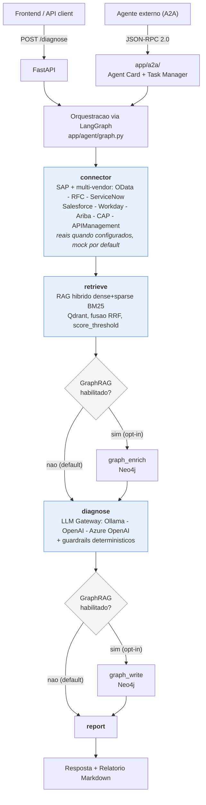

# Guia de Estudos - Integration Incident Copilot

> Documento de sintese, para releitura e consolidacao de aprendizado.
> Nao e um log da construcao do projeto - e o que restou depois de
> filtrar tentativa e erro. Para a investigacao completa de qualquer
> item, os documentos-fonte estao linkados ao final de cada secao.

---

## 1. Resumo Executivo

O **Integration Incident Copilot** e um agente de IA que diagnostica
incidentes de integracao - SAP e nao-SAP. Dado um incidente - texto
livre e/ou dados estruturados de um conector - ele recupera o caso de
troubleshooting mais parecido numa base de conhecimento vetorial
(busca hibrida: densa + esparsa), usa um LLM para produzir causa
raiz e proximos passos, e devolve um relatorio em Markdown.

**Por que existe:** o SAP AI Core exige HANA Cloud como camada
obrigatoria, independente do quanto de IA for consumido - isso exclui
estruturalmente ~40-45% da base de clientes SAP ECC do mundo (Gartner/
IDC), que deve permanecer em sistemas legados alem de 2027. Este
projeto e a prova tecnica de que da pra levar IA de diagnostico real
(RAG + agente + conectores) pra esse publico, rodando local ou sobre
um provedor que o cliente ja tenha - ver
docs/TCO_SAP_AI_CORE_VS_SELF_HOSTED.md.

**Stack:** Python (uv), FastAPI, LangGraph, LangChain, Qdrant (RAG
hibrido dense+sparse), Neo4j (GraphRAG opt-in), Ollama/OpenAI/Azure
OpenAI (LLM Gateway plugavel), Langfuse (observabilidade), pytest,
promptfoo, Docker Compose, GitHub Actions.

**Por que importa como peca de portfolio:** nao e so "um RAG que
funciona" - e um agente com guardrails deterministicos (nao confia
cegamente no LLM), decisoes de modelo embasadas em comparacao formal,
oito conectores multi-vendor (quatro validados contra sistema real: Salesforce, ServiceNow, CAP, RFC/ABAP Trial — nao
so mock), camada A2A real (protocolo aberto), e um historico
documentado de bugs reais encontrados e corrigidos com metodologia,
nao achismo.

Repositorio: github.com/marcos-slima/sap-integration-copilot

---

## 2. Arquitetura




**Princípio central:** o connector roda antes do retrieve — dado
estruturado de sistema (quando disponível) tem prioridade sobre
descrição textual do usuário, tanto na busca quanto no prompt do LLM.
O LLM Gateway é invocado de dentro do node diagnose, não é uma etapa
própria separada — o restante do grafo não sabe (nem precisa saber)
qual provedor de LLM está por trás.

Aprofundamento com roteiro de debug: docs/TUTORIAL_ARQUITETURA_DEBUG.md
Detalhamento por camada: docs/ARCHITECTURE.md

---

## 3. Código Final (estado atual, não histórico)

### Interface comum de conectores

```python
# app/connectors/base.py
class SAPConnector(ABC):  # alias ExternalSystemConnector para nao-SAP
    @abstractmethod
    def fetch(self, identifier: str) -> ConnectorResult:
        raise NotImplementedError

@dataclass
class ConnectorResult:
    source_system: str
    status: str
    error_code: str | None
    message: str
    raw: str
    is_mock: bool = True
    is_fallback: bool = False
```

### LLM Gateway plugável

```python
# app/llm/factory.py
def get_chat_model(model_name: str | None = None) -> BaseChatModel:
    # Settings.llm_provider: "ollama" (default) | "openai" | "azure_openai"
    # Falha alto e claro (ConfigurationError) se faltar config
    ...
```

### Configuração centralizada

```python
# app/config.py
class Settings(BaseSettings):
    llm_provider: Literal["ollama", "openai", "azure_openai"] = "ollama"
    ollama_host: str = "http://127.0.0.1:11434"
    llm_model: str = "qwen2.5-coder:32b"
    qdrant_url: str = "http://127.0.0.1:6333"
    graph_rag_enabled: bool = False
    model_config = SettingsConfigDict(env_file=".env")

settings = Settings()
# Verificação: uv run python -m app.config
```

### Saída estruturada com guardrails em camadas

```python
# app/agent/graph.py
class DiagnosisModel(BaseModel):
    matched_source: str | None = Field(default=None, description="...")
    probable_root_cause: str = Field(description="...")
    confidence: float = Field(ge=0.0, le=1.0, description="...")
    next_steps: list[str] = Field(default_factory=list)

def _apply_confidence_guardrails(diagnosis: dict, state) -> dict:
    diagnosis["confidence"] = max(0.0, min(1.0, float(diagnosis.get("confidence", 0.0))))
    return diagnosis
```

Código completo e atualizado: repositório, pasta app/

---

## 4. Setup Essencial

```bash
docker compose up -d
docker compose exec ollama ollama pull qwen2.5-coder:32b
docker compose exec ollama ollama pull nomic-embed-text

cd ~/integration-incident-copilot
uv sync
uv run uvicorn app.main:app --reload

uv run python -m app.rag.ingest --target incidents --reset
uv run pytest -v
uv run python -m app.config
```

**Armadilha a evitar:** o .venv pode silenciosamente deslizar para
uma versão de Python diferente da pinada após uv sync/uv add
repetidos — sempre confirmar com uv run python --version.

---

## 5. Decisões Técnicas

| Decisão | Por quê |
|---|---|
| LLM Gateway plugável | Viabilizar IA para quem não paga SAP AI Core exige rodar local ou sobre provedor do cliente, sem reescrever o grafo |
| qwen2.5-coder:32b em produção | Comparação formal via promptfoo venceu duas rodadas contra concorrentes que falharam de forma reproduzível no caso crítico |
| Contexto restrito ao top-1 | Top-3 causava mistura de causa raiz |
| seed fixo | temperature=0 sozinho não garante determinismo |
| Guardrails no código | LLM não é confiável para autoavaliar incerteza |
| Busca híbrida dense+sparse | Embeddings puros perdem termos exatos (códigos de erro) |
| Todo conector: mock se ausente, real se configurado | Prototipar sem credencial, trocar sem mudar código |
| A2A sem SDK externo | Protocolo aberto reimplementado direto; SDKs de terceiros imaturos |

Detalhamento completo: README.md, seção "Decisões de Arquitetura" (14 itens)

---

## 6. Lições Aprendidas

1. Mistura de contexto: top-3 causava mistura → restringido a top-1.
2. Não-determinismo: temperature=0 não bastava → seed explícito.
3. Alucinação sob dado desconhecido: guardrail determinístico resolveu.
4. Regressão de modelo: candidato com melhor média falhou 3/3 no crítico.
5. Field(description=...) não influencia geração via with_structured_output no Ollama — só restringe tipo/formato. Correção real exigiu texto no prompt.
6. Isolamento de teste quebrado: 7 testes demo_mode/mock dependiam do .env vazio — corrigido com monkeypatch explícito.
7. Encoding OData v4: httpx codifica espaço como "+", CAP exige "%20" — corrigido com urllib.parse.quote.
8. pyrfc arquivado pela SAP (maio/2026) — bloqueio de RFC é pessoal (falta de S-user), não comercial pro cliente real.
9. Diagrama do README estava paralelo, fluxo real é sequencial — corrigido.

Contexto completo: docs/PROCESSO_DESENVOLVIMENTO.md

---

## 7. Glossário de Ferramentas

| Ferramenta | Papel |
|---|---|
| FastAPI | /diagnose (REST) e Agent Card A2A |
| Pydantic/pydantic-settings | Contratos de dados e config tipada |
| LangGraph | Orquestra o fluxo como máquina de estados |
| LangChain | Integração Ollama/OpenAI/Azure |
| Qdrant | Busca híbrida dense+sparse do RAG |
| fastembed | Vetores esparsos BM25, 100% local |
| Neo4j | GraphRAG opt-in |
| Ollama/OpenAI/Azure OpenAI | LLM Gateway plugável |
| XSUAA | Autenticação OAuth2 do BTP (CAPConnector) |
| Langfuse | Observabilidade |
| pytest | 65 testes não-integração |
| promptfoo | Comparação formal de modelos |
| uv | Gerenciador de ambiente Python |
| Docker Compose | Stack self-contained |
| gitleaks/pre-commit | Segurança e qualidade automáticas |
| GitHub Actions | CI |

Lista completa: docs/ferramentas-sustentacao-ecossistema.md

---

## Onde ir a partir daqui

- Entender o fluxo com debugger: docs/TUTORIAL_ARQUITETURA_DEBUG.md
- Ver o processo completo: docs/PROCESSO_DESENVOLVIMENTO.md
- Tese de posicionamento (TCO): docs/TCO_SAP_AI_CORE_VS_SELF_HOSTED.md
- Próximos passos: validar schema real do APIManagementConnector contra tenant real (implementado, mas especulativo), validação real de Workday/Ariba/RFC (bloqueados), definir corte de v1.0
